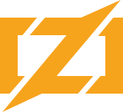

# z2d

A 2d vector graphics library, written in pure Zig.

## Example

The following code will generate the [Zig
logo](https://github.com/ziglang/logo) logomark:

<details>
<summary>Click to expand</summary>

```zig
const heap = @import("std").heap;
const mem = @import("std").mem;
const z2d = @import("z2d");

pub fn main() !void {
    var gpa = heap.GeneralPurposeAllocator(.{}){};
    const alloc = gpa.allocator();

    const width = 153;
    const height = 140;
    var surface = try z2d.Surface.init(.image_surface_rgba, alloc, width, height);
    defer surface.deinit(alloc);

    var context = try z2d.Context.init(alloc, &surface);
    defer context.deinit();
    context.setSource(.{ .rgb = .{ .r = 0xF7, .g = 0xA4, .b = 0x1D } });
    try fillMark(&context);
    try z2d.png_exporter.writeToPNGFile(surface, "zig-mark.png");
}

/// Generates and fills the path for the Zig mark.
fn fillMark(context: *z2d.Context) !void {
    try context.moveTo(46, 22);
    try context.lineTo(28, 44);
    try context.lineTo(19, 30);
    try context.closePath();
    try context.moveTo(46, 22);
    try context.lineTo(33, 33);
    try context.lineTo(28, 44);
    try context.lineTo(22, 44);
    try context.lineTo(22, 95);
    try context.lineTo(31, 95);
    try context.lineTo(20, 100);
    try context.lineTo(12, 117);
    try context.lineTo(0, 117);
    try context.lineTo(0, 22);
    try context.closePath();
    try context.moveTo(31, 95);
    try context.lineTo(12, 117);
    try context.lineTo(4, 106);
    try context.closePath();

    try context.moveTo(56, 22);
    try context.lineTo(62, 36);
    try context.lineTo(37, 44);
    try context.closePath();
    try context.moveTo(56, 22);
    try context.lineTo(111, 22);
    try context.lineTo(111, 44);
    try context.lineTo(37, 44);
    try context.lineTo(56, 32);
    try context.closePath();
    try context.moveTo(116, 95);
    try context.lineTo(97, 117);
    try context.lineTo(90, 104);
    try context.closePath();
    try context.moveTo(116, 95);
    try context.lineTo(100, 104);
    try context.lineTo(97, 117);
    try context.lineTo(42, 117);
    try context.lineTo(42, 95);
    try context.closePath();
    try context.moveTo(150, 0);
    try context.lineTo(52, 117);
    try context.lineTo(3, 140);
    try context.lineTo(101, 22);
    try context.closePath();

    try context.moveTo(141, 22);
    try context.lineTo(140, 40);
    try context.lineTo(122, 45);
    try context.closePath();
    try context.moveTo(153, 22);
    try context.lineTo(153, 117);
    try context.lineTo(106, 117);
    try context.lineTo(120, 105);
    try context.lineTo(125, 95);
    try context.lineTo(131, 95);
    try context.lineTo(131, 45);
    try context.lineTo(122, 45);
    try context.lineTo(132, 36);
    try context.lineTo(141, 22);
    try context.closePath();
    try context.moveTo(125, 95);
    try context.lineTo(130, 110);
    try context.lineTo(106, 117);
    try context.closePath();

    try context.fill();
}
```

</details>

### Output



(More examples exist in the [`spec/`](spec/) directory!)

## About

z2d is a 2D graphics library primarily designed around rasterizing vector
primitives like lines and cubic Beziers. In other words, it's designed around
supporting operations that you would see in SVG or other vector languages like
PostScript or PDF.

Our drawing model is (loosely) inspired by
[Cairo](https://www.cairographics.org): most operations take place through the
`Context`, which connect `Pattern`s (pixel/color sources) and `Surface`s
(drawing targets/buffers). `Path`s contain the vector data for filling and
stroking operations.

Every component of z2d can be worked with directly in an unmanaged fashion
without the `Context` as well, if so desired; `Surfaces` can be interfaced with
directly, `Surface` and `Path` can be used with static buffers (in addition to
their traditional unmanaged variant), and the painter methods for filling and
stroking can be called directly with the output of these. For these cases,
`Context` serves as a reference example.

## What's supported

Currently:

 * Basic rendering of lines and cubic Beziers, with helpers for arcs (circles
   native, ellipses through transformations).
 * Filling and stroking:
   - Miter, bevel, and round join supported for stroking.
   - Butt, square, and round caps supported for stroking.
   - Dashed lines supported along with offsets for tweaking alignment of
     patterns to shapes, and zero-length dash stops to draw dotted lines.
 * Transformations: rotate, scale, translate, and other operations via direct
   manipulations of the affine matrix.
 * Composition:
   - Single pixel sources and linear, radial, and conic gradients supported.
     Access to lower-level compositor primitives is supplied to allow for
     manipulation of surfaces outside of higher-level drawing operations.
 * Pixel formats:
   - RGBA, RGB, and alpha-only in 8, 4, 2, and 1-bit formats.
 * Color spaces:
   - Linear, sRGB, and HSL currently supported for specifying high-level color.
     Interpolation supported in certain color spaces (conversion and
     interpolation always done in linear space). More color spaces are planed.
 * Exporting:
   - Rudimentary PNG export supported; alpha-channel formats export to
     greyscale.

The current plan is to work towards writing a reasonably feature-complete SVG
renderer, with the ability to utilize the same primitives to perform other
vector rasterization, suitable for UI design and other similar tasks.

## Usage

`zig fetch --save git+https://github.com/vancluever/z2d#[tag or commit]`

Development currently is working off of Zig 0.13.0, YMMV with versions outside
of 0.13.0.

There is currently a `zig-0.14.0` branch that is currently being updated
against the latest Zig 0.14.0. 

## Documentation and examples

View the documentation for the `main` branch at: https://z2d.vancluevertech.com/docs

See the [`spec/`](spec/) directory for a number of rudimentary usage examples.

## LICENSE and acknowledgments 

z2d itself is licensed MPL 2.0; see the LICENSE file for further details.

Code examples in the [`spec/`](spec/) directory are licensed 0BSD, this means
you can use them freely to integrate z2d.

The [Zig logo](https://github.com/ziglang/logo) and logomark are licensed
CC-BY-SA 4.0.
